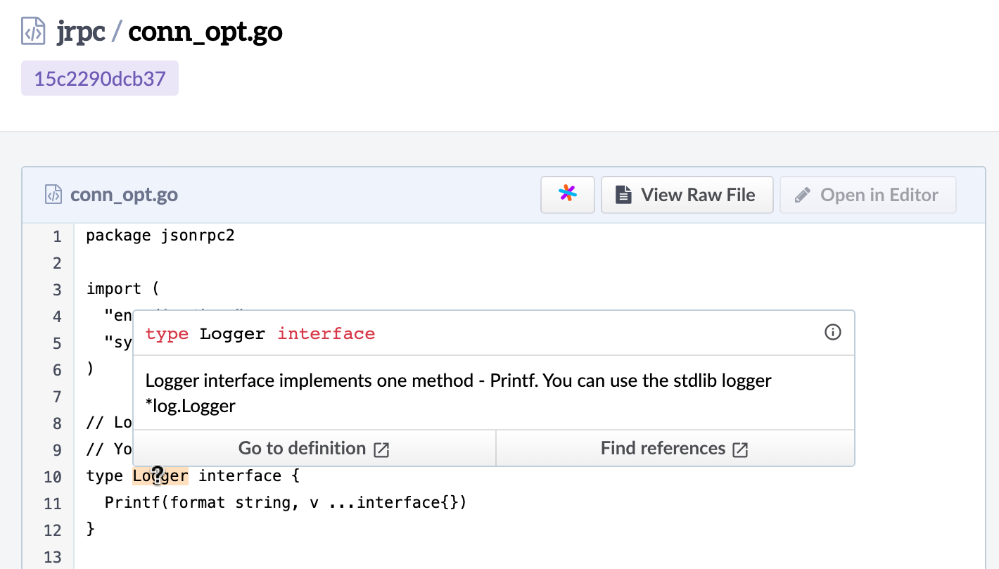
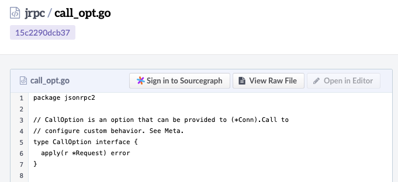

# Sourcegraph Phabricator integration

Sourcegraph's Phabricator integration adds Sourcegraph code intelligence and search to Phabricator diffs and code files, so you get go-to-definition, find-references, hover tooltips, and code search embedded natively into Phabricator.

## Installation

1. Navigate to the Phabricator root directory on your Phabricator instance (eg. `/opt/bitnami/phabricator` if you're using the https://github.com/bitnami/bitnami-docker-phabricator).
2. Clone this repository to `src/extensions/sourcegraph`:

```
git clone -b release-v1.2 https://github.com/sourcegraph/phabricator-extension.git src/extensions/sourcegraph
```
3. Run `bin/celerity map` to [add the static CSS/JS assets](https://secure.phabricator.com/book/phabcontrib/article/adding_new_css_and_js/).
4. [Restart Phabricator](https://secure.phabricator.com/book/phabricator/article/restarting/).

## Upgrade

To upgrade from an older version of the Phabricator integration:

1. Navigate to the Phabricator root directory on your Phabricator instance.
2. Use `git pull` to upgrade the Sourcegraph integration:

```
pushd src/extensions/sourcegraph && git pull origin release-v1.2 && popd
```
3. Run `bin/celerity map` to [add the static CSS/JS assets](https://secure.phabricator.com/book/phabcontrib/article/adding_new_css_and_js/).
4. [Restart Phabricator](https://secure.phabricator.com/book/phabricator/article/restarting/).


## Quickstart

1. [Update the Sourcegraph site configuration](https://about.sourcegraph.com/docs/config/) to allow scripts on your Phabricator instance to communicate with your Sourcegraph instance:

```
{
   // ...
   "corsOrigin": "$PHABRICATOR_URL"
   // ...
}
```

2. Set the Phabricator `sourcegraph.url` configuration value to your Sourcegraph URL.

## Configuration

You can update the Phabricator integration's configuration via the command line or **Application Settings** in your Phabricator instance.

### `sourcegraph.url` (string)

URL to Sourcegraph Server.

For example:

```shell
'https://sourcegraph.example.com'
```

### <a name="callsign-mappings"></a>`sourcegraph.callsignMappings` (array)

If your Phabricator installation mirrors repositories from a different origin than Sourcegraph, you must specify a list of repository `paths`s (as displayed on Sourcegraph)
and their corresponding Phabricator `callsign`s.

An array of objects, each mapping a Phabricator repository\'s callsign to the corresponding repository on Sourcegraph. Each object contains the following properties:

* `path` **(string, required)** The path of the repository on Sourcegraph.

* `callsign` **(string, required)** The Phabricator callsign for the repository.

For example:

```shell
'[{"path": "gitolite.example.org/foobar", "callsign": "FOO"}]'
```

### Restarting Phabricator

How to restart Phabricator depends on how you installed it. Usually it is one of the following commands:

* `sudo service apache2 restart`
* `supervisorctl -c /app/supervisord.conf restart php-fpm`
* `supervisorctl -c /app/supervisord.conf restart nginx`
* `supervisorctl -c /app/supervisord.conf restart nginx-ssl`

If Phabricator is running via [Bitnami's docker image](https://github.com/bitnami/bitnami-docker-phabricator) use:

* `bin/phd restart` inside your Phabricator installation directory.

See [Phabricator's restart
docs](https://secure.phabricator.com/book/phabricator/article/restarting/) for more information.

## Supported Versions

* [Phabricator](https://github.com/phacility/phabricator) stable builds after January 2017
* [Bitnami](https://github.com/bitnami/bitnami-docker-phabricator) Docker tags after 2017.09-r1
* [RedpointGames](https://github.com/RedpointGames/phabricator) Docker images

## Usage

### Native code intelligence

Once configured, the Sourcegraph Phabricator integration will add code intelligence hovers to Diffusion code view and Differential diffs for all users that are logged in to your self-hosted Sourcegraph instance. It will also add links to view repositories, files and diffs on Sourcegraph.



If a user is not logged in to Sourcegraph, they will still see "Sign in to Sourcegraph" links, and code intelligence hovers will not be displayed.



## Troubleshooting

If you're not seeing code intelligence hover tooltips on Phabricator, relevant errors will most frequently be shown in the browser console of your Phabricator instance. Some of the most frequent errors are listed below.

### CORS error in browser console

If `corsOrigin` is not properly configured in your Sourcegraph instance's site configuration, the following error will be shown in the browser console:

```
Access to fetch at 'https://sourcegraph.test:3443/.assets/extension/css/style.bundle.css?v=0.0.0' from origin 'https://phabricator.test' has been blocked by CORS policy: No 'Access-Control-Allow-Origin' header is present on the requested resource. If an opaque response serves your needs, set the request's mode to 'no-cors' to fetch the resource with CORS disabled.
```

See the [quickstart](#quickstart) section to configure `corsOrigin`.

### RepoNotFoundError in browser console

If the Phabricator integration fails to resolve a repository, a `RepoNotFoundError` will be logged to the browser console. This may indicate that your [callsign mappings](#callsign-mappings) are misconfigured, or that the repository you're viewing is not synced to your Sourcegraph instance.

```
Could not resolve file info for code view RepoNotFoundError: repo gitolite.example.org/sourcegraph/jsonrpc2 not found
```

## Known issues

### Staging areas

When you commit a code change and run `arc diff` to push your changes to Phabricator, only the change's diff gets pushed.
This means unless you run `git push` on your own, your commits won't be pushed to your remote repo. Because of this, Sourcegraph
and other tools using this diff's information won't be able to find the contents of the diff. To get around this, Phabricator has an experimental
feature called **staging areas**.

Staging areas are Git repositories that store all of the information for a given diff so that its position in a Git repository's
history isn't lost. [Learn more about Phabricator staging areas and how to enable them.](https://secure.phabricator.com/book/phabricator/article/harbormaster/#change-handoff)

If there is no staging area enabled and we can't resolve the commit, Sourcegraph tries to apply the diff's patch set to simulate a staging area.
This will work _most_ of the time. However, there are several cases where this will fail. Two examples of cases where this would fail is when you
run `arc diff` on a base that isn't in master or if you created a diff from the Phabricator UI. The only way to ensure reliable code intelligence
on all Phabricator diffs is to enable staging areas for your repositories.

## Reporting issues

For issues with or feature requests for this integration, [file an issue](https://github.com/sourcegraph/phabricator-extension-install/issues). For any other issues or feedback related to Sourcegraph, use [sourcegraph/issues](https://github.com/sourcegraph/issues).
